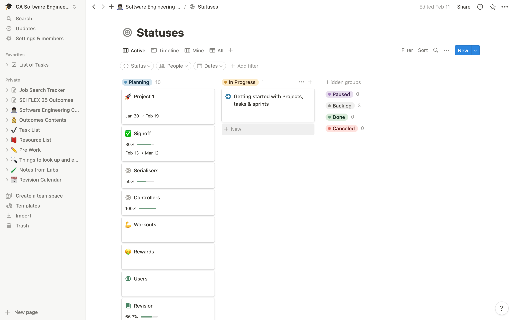
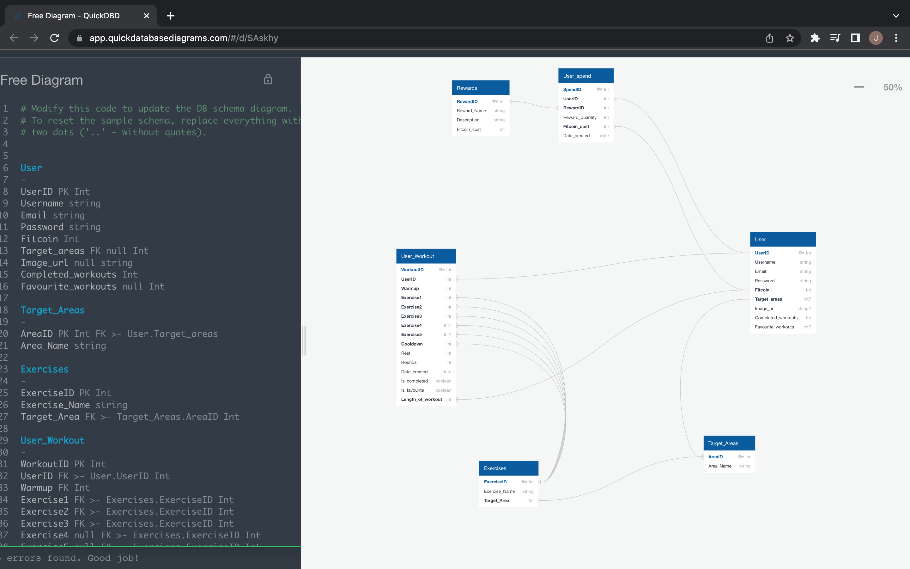
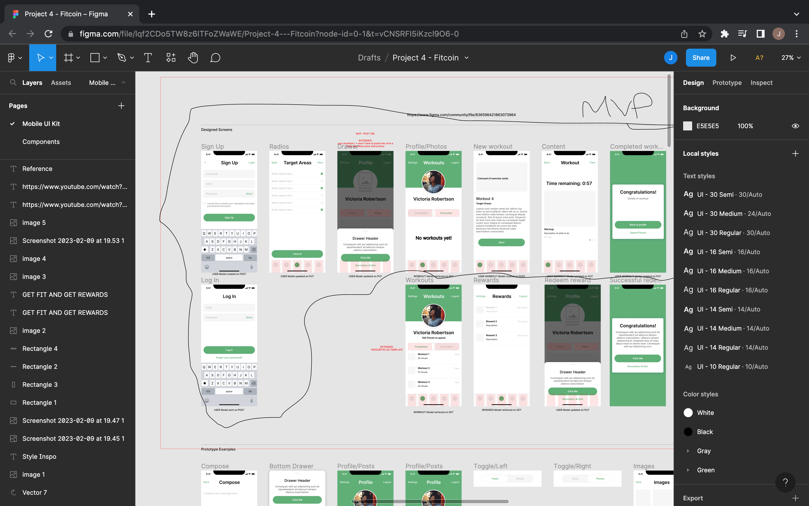

# Project 4: "Fitcoin"

## Description


Over 5 months at General Assembly, I’d been learning how to use HTML, CSS, JS and MongoDB, and in the final module of the Software Engineering Immersive course, I was given the opportunity to apply some transferable skills from the last module to quickly learn how to use Python and SQL to create an app. We were given 18 days to complete the project, which focuses on using Flask, PostgreSQL and React, and were given starter code for the project. 


### Link to the gane

[HERE](https://fitcoin.netlify.app/)

## Getting Started/Code Installation

- Download Backend and Frontend starter code
- Create a folder in the development directory so that it can be linked to your Github
- Read through the documentation relating to TypeScript, JavaScript, React, Python, Flask, Marshmallow, and PostgreSQL


## Timeframe & Working Team

- I decided to work independently for this project
- Timeframe: 18 days

## Technologies Used

### Languages, libraries and frameworks

#### Backend:
- Python
- Flask
- Marshmallow

#### Frontend:
- JS
- React
- CSS

#### Database:
- SQL
- PosgreSQL

### Tools:

#### Clients:
- TablePlus
- Insomnia

#### IDE:
- Visual Studio Code (VSCode)

#### Troubleshooting, Diagnostic and Testing:
- Chrome Dev Tools

#### Design:
- Figma
- Excalidraw
- Quick Database Diagrams

#### Agile product management:
- [Notion](https://mountainous-dirigible-cc0.notion.site/5983943b518e4d7aaa781b9c84a0a97d?v=c2fd13de4edf40458a2deb93e4405846)

#### Time management:
- Toggl Track (iOS)
- BeFocused (macOS)

I chose to work with Notion for the following reasons:
- Although JIRA is the industry standard for planning and managing tasks, I’m working independently and don’t need all the features
- The features that I need (creating a list of tasks, organising the tasks with labels, creating sprints) are in Notion
- I use Notion for studying and keeping organised in my day-to-day and find that it’s easy to manage on-the-go
- There are many templates and integration that I can use that help with this, and I created my sprints and task list with a template and edited the views to help me stay organised

#### Task vuew:


## Brief

### Technical Requirements:

I will need to:

- Build a full-stack application by making your own backend and your own front-end
- Use a Python Flask API using a Flask REST Framework to serve your data from a Postgres database
Consume your API with a separate front-end built with React
- Be a complete product which most likely means multiple relationships and CRUD functionality for at least a couple of models
- Implement thoughtful user stories/wireframes that are significant enough to help you know which features are core MVP and which you can cut
- Have a visually impressive design to kick your portfolio up a notch and have something to wow future clients & employers. ALLOW time for this.
- Be deployed online so it's publicly accessible.


**Necessary Deliverables**

- A working app hosted on the internet
- A link to your hosted working app in the URL section of your Github repo
- A git repository hosted on Github, with a link to your hosted project, and frequent commits dating back to the very beginning of the project
- A readme.md file with:
  - An embedded screenshot of the app
  - Explanations of the technologies used
  - A couple paragraphs about the general approach you took
  - Installation instructions for any dependencies
  - Link to your user stories/wireframes – sketches of major views / interfaces in your application, if applicable
  - Descriptions of any unsolved problems or major hurdles you had to overcome


## Planning

Models/Tables: https://app.quickdatabasediagrams.com/#/d/SAskhy



This tool was useful for looking at how the tables and their models would relate to one another before writing them in code. 

On the left is the SQL-like code which shows the schema of the tables.

The tool does not create many-to-many relationships between tables, so it makes it easier to identify which tables need to be created as intermediary/junction tables.

With this tool, I was able to identify that I needed to build 6 tables:


1. User
2. Target_Areas
3. Exercises
4. User_Workout
5. User_spend
6. Rewards

### Building the wireframes and prototype for the app:

[figma](https://www.figma.com/file/lqf2CDo5TW8z6lTFoZWaWE/Project-4---Fitcoin?node-id=0%3A1&t=cGroF4Ocid5mtcAa-1)



I used Figma to help me visualise what I wanted to build and how each screen would work. This was useful as I could then start to see how the models would relate to one another, how my frontend and backend should interact with one another and how complicated the project could be. I presented my wireframe and models to the instructional team and we decided that my MVP was definitely something I could build in the next 2 weeks. My Rewards system and any other features would be left to the end of the project.


## Build/Code Process

To run this project, you will need to have Python, PostgreSQL, and Node.js installed on your computer. You will also need to have TablePlus or another database management tool installed to view the database, and Insomnia as my client to view or edit data seen on my API.

### Backend

I was given starter code to work with my backend. Below, we can see the contents of the pipfile in the backend folder when I started:

```
[source]]
url = "https://pypi.org/simple"
verify_ssl = true
name = "pypi"


[packages]
flask = "*"
sqlalchemy = "==2.0.1"


[dev-packages]


[requires]
python_version = "3.9"
```

This means that Flask and SQLAclchemy were already installed. When I ran `pip install pipenv` (and `pip3 install pipenv` for good measure), the pipfile was updated so the python version stated was 3.9.

As Flask was already installed, I did not need to run `pipenv install flask` but without the start code, I would need to do this.

From here, we’d go to the app.py file, and make sure that Flask is imported, and then instantiated.

```
from flask import Flask
app = Flask(__name__)
```


I worked in a Model/View/Controller style of coding to create my backend.

The models (seen below) for the data that would be visible as in my database were defined carefully before being used elsewhere in my code.

The views, in my opinion, were defined using the frameworks that were installed to input information into my database from Python (using SQLAlchemy) and convert the dictionaries from Python into web-readable JSON (using serialisers and Marshmallow). 

The controllers, which are known as the ‘business logic’ were responsible for making sure that certain functions would run when the API had certain requests with the assistance of decorators in the code. The controllers also supported the ‘views’ component of the coding, as routes were defined here.

```
## get all exercises
@router.route('/exercises', methods=["GET"])
def get_all_exercises():
 exercises = ExerciseModel.query.all()


 if not exercises:
   return { "message": "Exercises not found" }, HTTPStatus.NOT_FOUND
  try:
   print(exercises)
   return exercise_schema.jsonify(exercises, many=True), HTTPStatus.OK


 except ValidationError as e:
   return { "errors" : e.messages, "message": "Something went wrong" }

```


### Database:

I needed to install PostgreSQL using the steps outlined in the documentation for Python (https://www.postgresql.org/download/) (along with other supplementary libraries, e.g. psycopg2) and once that was done, I created a Fitcoin database in my terminal with the command `createdb fitcoin-db`.

I created a BaseModel which included properties and methods that were inherited by all of my models.


```
#  This is the SQLA model that relies on everything
 # id,created_at,updated_at are the status fields/columns that each model has
class BaseModel:
   id = db.Column(db.Integer, primary_key=True)
   created_at = db.Column(db.DateTime, default=datetime.utcnow)
   updated_at = db.Column(db.DateTime, default=datetime.utcnow, onupdate=datetime.utcnow)
  
   ## add the item, then commit the item
   def save(self):
     db.session.add(self)
     db.session.commit()
  
   ## remove the item, then commit the item
   def remove(self):
     db.session.remove(self)
     db.session.commit()


   ## seen an additional option to use delete instead of remove. delete the item, then commit the item
   def delete_me(self):
     db.session.delete(self)
     db.session.commit()
```

Using my plan, I then created my models referencing the BaseModel, and created data for each of my models and a controller that had some basic functions for retrieving information.

The data for my models that I’d created in my seed.py file was then seeded using the command `pipenv run seed.py`.

```
with app.app_context():
   try:
     print('Creating...')
     db.drop_all()
     db.create_all()


     print('Seeding...')


     # seeded in order of succession. Everything relies on the user, so user is seeded first
    
     target_area=TargetAreaModel(name="core")
     target_area.save()


     target_area1=TargetAreaModel(name="shoulders")
     target_area1.save()


     #! note to use args, kwargs in seeding for target_areas so there's a full table
     # exercise = ExerciseModel(name="plank")
     exercise = ExerciseModel(name="plank",target_area_id=target_area.id)
     exercise.save()


     # # exercise2 = ExerciseModel(name="shoulder rotations",target_area_id=target_area1.id)
     # exercise2 = ExerciseModel(name="shoulder rotations")
     # exercise 2.save()


     # # exercise3 = ExerciseModel(name="crunches",target_area_id=target_area.id)
     # exercise3 = ExerciseModel(name="crunches")
     # exercise3.save()


     #* target_area -> exercises has been mapped successfully and we can see this in tableplus


     user = UserModel(username="jane",email="jane@jane.co", password="highcupsintegerwow",
     fitcoin=0, target_areas=1, image_url="https://img.icons8.com/color/480/lumpy-space-princess.png")
     user.save()


     #! note to use args, kwargs in seeding for exercises so there's a full table


     print(exercise.id)
    
     # workout = WorkoutModel(warmup=1,exercise1=exercise.id, exercise2=exercise2.id, exercise3=exercise3.id, cooldown=1, rest=1,length_of_workout=10)
     workout = WorkoutModel(user_id=user.id, warmup=1, cooldown=1, rest=1,length_of_workout=10)
     workout.save()


     #! here I make a workout exercise
     workout_exercise = WorkoutExerciseModel(workout_id=workout.id, exercise_id=exercise.id)
     workout_exercise.save()


     reward = RewardModel(name="£10 Sephora voucher", description="£10 to use at Sephora, online and in stores.",fitcoin_cost=900)
     reward.save()
    
     spend = SpendModel(reward_quantity=1,fitcoin_cost=100)
     spend.save()


     print('Completed!')


   except Exception as e:
     print(e)
```

The seed data was important for me as it enabled me to double check that the contents of my models were correct, allowed me to work with some data while I was trying to create the logic in the controllers to generate data in my API without needing the seed.

With Insomnia, I was then able to see if I had correctly seeded my data and if the controllers including the logic for my app were correct.

### Frontend:

I was given starter code to work with my frontend, similar to the starter code that was used in previous projects.  This included:
- the root folder, which has:
- a .gitignore file that tells us which files should be ignored when I’m committing and pushing code 
- an index.html which contains an element with an id of ‘root’, which is where the react code is rendered
- package.json and package-lock.json files which show which packages (frameworks and libraries) which have been installed, what their versions are and other information related to the packages
- tsconfig.json and tsconfig.node.json files which are related to how Typescript is set up in the project
- and the src folder, that lives within the root, which is where the code that I would write existed

To work on JS locally, I had to install Node.js, referencing this documentation (https://nodejs.org/en/docs/).

I then went to the package.json file and made sure that the following scripts are included:

```
"scripts": {
    "dev": "vite",
    "build": "tsc && vite build",
    "preview": "vite preview"
}
```

Once node was installed, I was then able to use the terminal in VSCode with the keyword ‘npm’ (node package manager) to make changes to run the code. Running `npm run dev` would start the website in my browser, and would hot reload when any changes were made.

### Testing:

To ensure that the database was working as expected, I was testing with Insomnia and TablePlus.

TablePlus is a program which allows users to create, view and manage databases. With seeding, I was able to use TablePlus to check if the data had been populated correctly.

Insomnia is a client that’s used to manage API requests, so I could use this to check that the requests were being made correctly, and that my serialisers were properly set up.

## Challenges

Out of all the projects I’d worked on previously, this was the most challenging for me.

The backend, database and frontend was created and managed solely by me, so it was my first individual frontend project, and I was learning Python and PostgreSQL to build it.

I found that the trickiest issues that I had were related to the database and ultimately caused by the complexity of the models that I’d created initially. As I had a very fixed idea of what I wanted to build and believed that I’d be able to push through with the idea in its entirety, I spent a lot of time combing through the weeds caused by the complicated many-to-many relationships of my database, and eventually decided to simplify the models.

Here are a couple of examples of the issues I had so resolve with my models:

- ### I redid my models after I realised that some of my relationships were not lining up as I’d expected. When I would re-seed, I’d see an error.

I learned that I needed to delete the relationship first, but without deleting any tables, and then removing the table I needed to drop before re-seeding.


- ### I got stuck with making sure that my many to many relationships that existed on multiple tables were connecting properly. 

As a result, I had to re-do my models and refactor the code so it was easier to read and track. I also knew that I had to create junction tables, but with the models becoming more complicated, I realised that I needed to make more junction tables than I had initially thought after I’d tried to establish relationships with the existing tables. Although I could have worked backwards and realised what exactly needed to be updated, it was easier for me to just start again.

Both examples demonstrate the importance of simplifying a project, especially as a newbie. In the future, I would have defined fewer models initially and made the models created simpler for an MVP. Once I was happy with my MVP, I’d then gradually add features, which would require more complicated models.


## Wins

One of the biggest wins of this project was successfully implementing the one-to-many and one-to-one relationships between models in the database using SQL. This was a complex task, but it allowed us to build a more robust and flexible database schema.

Another win was successfully deploying the app to production using Netlify and Fly.io. This allowed us to share the app with others and get feedback on our work.


### Making the video background on the landing page
Home.tsx

```
   <section className="section hero is-large has-bg-vid">
     <div className="hero-body">
       <div className="container">
       <div className="card-content">
         <span className="tag is-white title is-1">
           Fitcoin
         </span>
         <h2 className="subtitle is-2 has-text-white">
           Get rewards for working out
         </h2>
       </div>
     </div>
     </div>
   </section>
```
.has-bg-vid is responsible for the image background that was created in the CSS

```
.has-bg-vid {
 background: url('/media/landing-page-2.gif')center center;
 background-size: cover;
}
```
The background url comes from a link to an image. The image in question was https://www.youtube.com/watch?v=65fIV7EwBTc 

I downloaded the video and then used a software called Gifox to convert the video into a gif. After editing the gif so that the frames I wanted were in it, I then exported the gif and uploaded it to Google Drive, where I had a link to the video which was then added to my main.scss file. 


## Key Learnings/Takeaways

One of the biggest learnings from this project came from setting up the one-to-many and one-to-one relationships between models in the database using SQL. There were several iterations of the database schema before we were able to get the relationships working correctly, and simplifying the models earlier would have made the process less frustrating for me and I would have had a better project at the end of the timeframe.

Another challenge was deploying the app to production using Netlify and Fly.io. There were several configuration and deployment issues that we had to work through since I’d be working on so many different branches. In the future, I would definitely work on one branch at a time, or just code directly on main, so that my code was less messy before deployment and I could get the app running smoothly in less time.


## Bugs

I made a mistake of working on different branches at the same time, and forgetting to close them. This led to having many conflicts, which needed a lot of time to resolve. 

- The deployed site on Netlify doesn’t display correctly at the moment while the version locally works well. I will need to make some changes to the code to see where the issue lies in my deployed frontend
  - This includes some issues with my Navbar and moving through the site
  - As a side project, I’m committed to looking at this code and working to get the version on Netlify to work as well, or even better than what I have locally


## Future Improvements

- ### I would like to be able to make my controllers more streamlined. 

I’ve noticed that in a few places, I have created code that could be redundant and would benefit from refactoring.

An improvement for later projects would be to use variables in the controller where table names, model names etc could be imported into the controller files and then used as variables which would then require some degree of logic to assign in different scenarios.

- ### I would like develop the rewards system to a larger extent

The rewards system would allow people to use the Fitcoin gained to redeem rewards from third-parties, similarly to Sweatcoin and Vitality Rewards.

To do this I will need to:
Review the models
Review the controllers
Conduct some more research into how reward systems in place elsewhere work
Build some more components in my frontend
